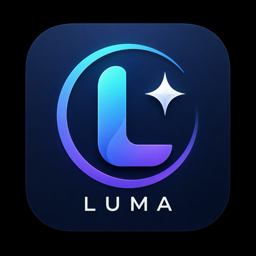
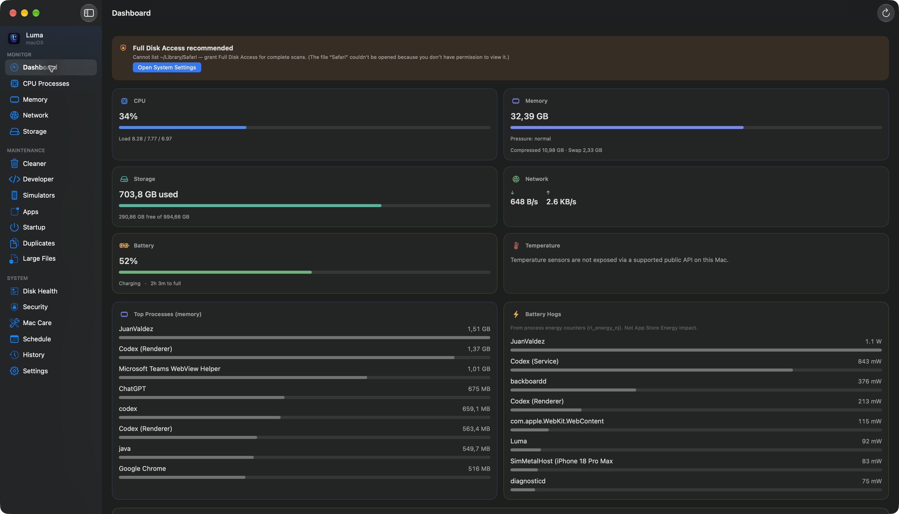
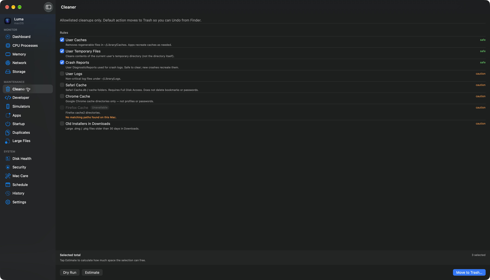
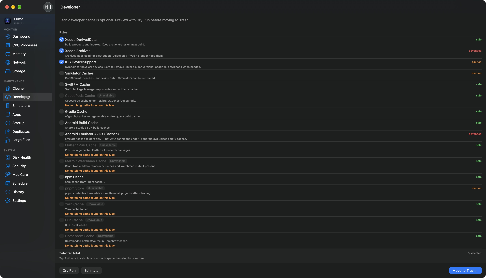
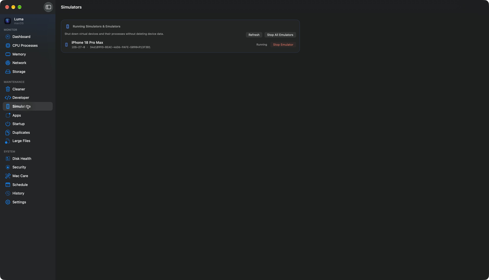

<p align="center">
  
</p>

# Luma pour macOS

[English](README.md) · [Türkçe](README.tr.md) · [Deutsch](README.de.md) · [Français](README.fr.md) · [Español](README.es.md) · [Italiano](README.it.md) · [Português (Brasil)](README.pt-BR.md) · [日本語](README.ja.md) · [한국어](README.ko.md) · [简体中文](README.zh-Hans.md) · [Русский](README.ru.md) · [العربية](README.ar.md)

**[Télécharger le DMG — v0.1.0](https://github.com/sekizlipenguen/luma-mac/releases/download/v0.1.0/Luma-0.1.0-macOS-universal.dmg)** · [ZIP](https://github.com/sekizlipenguen/luma-mac/releases/download/v0.1.0/Luma-0.1.0-macOS-universal.zip) · [SHA-256](https://github.com/sekizlipenguen/luma-mac/releases/download/v0.1.0/SHA256SUMS.txt)

**Comprendre votre Mac. Trouver ce qui occupe l’espace. Nettoyer en gardant le contrôle.**

Luma est une application SwiftUI native pour surveiller le système, examiner le stockage et entretenir votre Mac. Elle fonctionne localement, sans compte, abonnement, publicité ni télémétrie.

**Usage personnel et commercial gratuit et illimité :** aucune limite d’appareils, d’utilisateurs, de fonctionnalités ou de durée. Le code est consultable et compilable sans modification. Modifier votre propre copie ou créer une version dérivée nécessite une autorisation écrite. [Licence](LICENSE).

## Fonctionnalités

- **Vue d’ensemble et mémoire :** CPU, pression mémoire, mémoire compressée, swap, disque, réseau, batterie et compteurs d’énergie des processus. Aucun faux nettoyage de RAM.
- **Processus CPU :** regrouper les applications et leurs processus auxiliaires, rechercher, développer les détails et confirmer une fermeture normale.
- **Stockage et Finder :** examiner volumes, tailles de dossiers et gros fichiers ; mesurer un dossier dans Luma depuis Finder ou les Services.
- **Doublons :** comparer les contenus avec SHA-256 et examiner les résultats avant suppression.
- **Nettoyage et outils de développement :** règles autorisées et caches pris en charge, estimation, vérification et confirmation ; déplacement vers la Corbeille par défaut.
- **Applications et démarrage :** inventaire, fichiers associés sélectionnables individuellement, éléments de connexion et LaunchAgents. Les LaunchDaemons système restent consultables uniquement.
- **Simulateurs :** arrêter les simulateurs iOS et émulateurs Android après confirmation ; les appareils physiques sont exclus, leurs données ne sont pas effacées.
- **Disque et sécurité :** SMART si disponible ; FileVault, pare-feu, Gatekeeper, SIP et autorisations avec liens vers les réglages. Ce n’est pas un antivirus.
- **Entretien, planification et historique :** actions prises en charge et journaux locaux. La planification ouvre Luma sans supprimer silencieusement des fichiers.

## 12 langues d’interface

English · Türkçe · Deutsch · Français · Español · Italiano · Português (Brasil) · 日本語 · 한국어 · 简体中文 · Русский · العربية

Choisissez la langue dans Réglages → Langue, ou utilisez celle du système. Certains textes techniques ou non encore traduits peuvent apparaître en anglais.

## Sécurité et confidentialité

Les nettoyages passent par `CleanupRule` et `PathSafety`. Les zones système, trousseaux, Mail, Messages et clés SSH sont exclus. Les simulations ne modifient aucun fichier. Les fichiers dans la Corbeille restent récupérables via Finder tant qu’ils y sont.

Les fonctions principales restent locales. Les données indisponibles sont signalées : température sans API publique prise en charge, batterie éventuellement absente sur Mac de bureau, SMART dépendant du disque. [Modèle de sécurité](Docs/Safety-Model.md).

## Installation et prérequis

**macOS 15 ou ultérieur · Apple Silicon et Intel.** Ouvrez le DMG et glissez `Luma.app` dans Applications. Vous pouvez aussi extraire le ZIP de l’app. Les archives du code source ne contiennent pas l’app compilée.

**[Télécharger le DMG — v0.1.0](https://github.com/sekizlipenguen/luma-mac/releases/download/v0.1.0/Luma-0.1.0-macOS-universal.dmg)** · [ZIP](https://github.com/sekizlipenguen/luma-mac/releases/download/v0.1.0/Luma-0.1.0-macOS-universal.zip) · [SHA-256](https://github.com/sekizlipenguen/luma-mac/releases/download/v0.1.0/SHA256SUMS.txt)

**Aperçu 0.1.0 :** signature ad hoc, sans Developer ID ni notarisation Apple. macOS peut bloquer le premier lancement. Si vous faites confiance à la source, suivez les instructions Apple pour autoriser cette app. Un Mac administré peut empêcher cette exception. [Apple](https://support.apple.com/en-us/102445).

Pour les dossiers Library protégés : Réglages Système → Confidentialité et sécurité → Accès complet au disque. Sans autorisation, Luma ignore les emplacements inaccessibles. Activez l’extension Finder dans les réglages d’extensions macOS si souhaité. iOS nécessite les outils de ligne de commande Xcode ; Android nécessite les outils SDK, dont `adb`.

## Compiler le code sans modification

Il faut Xcode avec Swift 6, le SDK macOS 15 ou plus récent et XcodeGen. Cette commande produit une application signée ad hoc pour usage local, sans signature Developer ID ni notarisation.

```bash
git clone https://github.com/sekizlipenguen/luma-mac.git
cd luma-mac
brew install xcodegen
xcodegen generate
xcodebuild -project Luma.xcodeproj -scheme Luma -configuration Release -derivedDataPath build CODE_SIGN_IDENTITY=- CODE_SIGN_STYLE=Manual DEVELOPMENT_TEAM= build
```

Résultat : `build/Build/Products/Release/Luma.app`.

## Captures d’écran

Captures réelles avec interface anglaise ; les valeurs varient selon le Mac et sa charge.



<details>
<summary>Autres captures</summary>







</details>

## Licence et retours

La **Luma Free Use, No Modification License 1.0** autorise usage personnel et commercial illimité, consultation, compilation sans modification et partage de copies inchangées avec licence et mentions intactes. Modifications, dérivés et changement de marque nécessitent une autorisation écrite.

Luma est **source available**, pas open source au sens de l’OSI. Les droits GitHub de consultation et de fork demeurent, sans autorisation supplémentaire de modification. Les droits accordés précédemment ne sont pas révoqués. Le texte anglais [LICENSE](LICENSE) fait foi ; ce README est explicatif.

[Signaler un problème ou une idée](https://github.com/sekizlipenguen/luma-mac/issues) · [Politique de contribution](Docs/Contributing.md) · [Signalements de sécurité](SECURITY.md) · [Architecture](Docs/Architecture.md) · [Guide anglais détaillé](README.md)
